# Dassault UAV Challenge
## Teaching a Drone to Detect Targets on Artificially Generated Training Data
*Under the supervision of Prof. Nazih Mechbal and Prof. Marc Rébillat*

## Introduction

The [Dassault UAV Challenge](https://www.dassault-aviation.com/en/group/news/dassault-uav-challenge-2019/) is an annual competition between top engineering schools in Europe, during which a drone has to complete several missions in complete autonomy. The final objective is for the drone to autonomously explore a bounded area, detect targets of interest and deliver a package on the corresponding targets. In addition, the drone must deliver an accurate map of the explored area (see figure below). During the year 2019-2020, I was in charge of the team responsible for autonomous flight and target detection. The solution we proposed consisted in training a **deep neural network** (Google's Inception v2 in particular) on **artificially generated training images**. We mainly used the Tensorflow framework as well as the Open CV library throughout the project.

    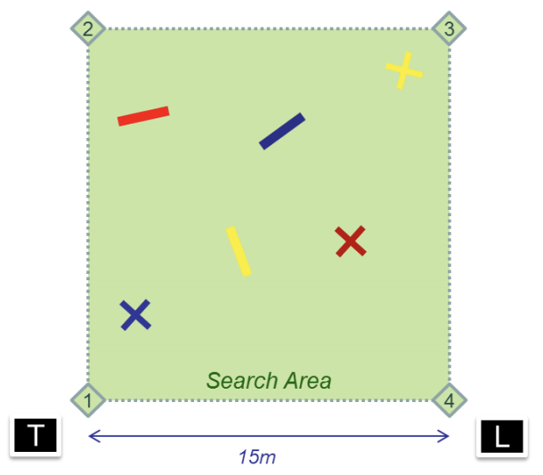

Figure: Search Area (T: Takeoff, L: Landing) Three packages (red, yellow and blue) must each be delivered onto the corresponding cross, rectangles are lures

## Generating Training Images
One of the most limiting factor while training object detection algorithms is the required quantity of training data. The accuracy of the detection depends on lots of factors such as the noise introduced by the drones' camera or the color of the ground during the competition. Physically taking and labelling photos of targets would offer very little flexibility with the produced dataset while being incredibly time-consuming.

Seeing as the classes we are trying to learn are pretty simple in shape and color, one solution we came up with was to generate training data using the *OpenCV* library in Python. The interesting aspect of this solution is that it allowed us to tinker with the following parameters:
- nuances and texture of the target
- nuances and texture of the background (which helps dissociating the background from the class of interest)
- shape of the target (imperfections e.g.)
- orientation and perspective of the image
- noise in the image (video quality)

All those factors greatly influence the quality of the training. The following images were generated using the *create_images.py* program inside the *create_images* directory and uses some utility functions I borrowed from the [LabelImg](https://github.com/tzutalin/labelImg) repository.

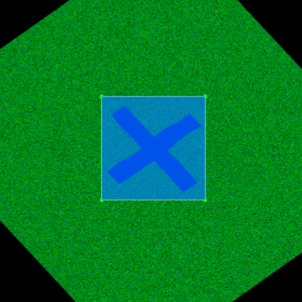

Blue Cross in its corresponding Bounding Box (little Gaussian Noise)

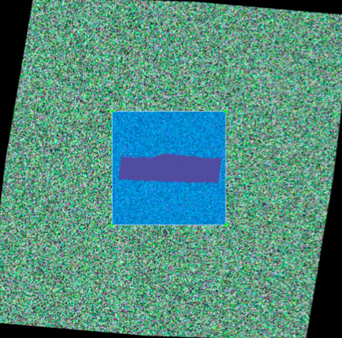

Red Rectangle in its corresponding Bounding Box (important Gaussian Noise in background)

Another great aspect of this methods is that it allows us to **automatically label the training data** (since we know where we generated the targets).

It might seem strange that we would deliberately add noise to our training data. **How can adding noise make learning more reliable?** Intuitively, the reason is that this added noise destroys inadvertent conspiracies. Thing is, overfitting happens because the learning algorithm sees some degree of conspiracies between the observed training labels and the input features. By adding noise into our images, many of these conspiracies will be masked because they are fundamentally sensitive to small details. **Adding our own noise allows us to exploit variance reduction and helps generalization performance.**

## Training Inception v2

We trained and cross-validated an implementation of Inception v2 on Tensorflow, using 9000 generated images (1500 for each class). It seems that the trained model performs pretty well on real world data, even in case of **incomplete / imperfect images**. It somehow messes up colors sometimes and seems to display a certain imbalance for yellow shapes but, this could be resolved during the post-processing phase, using a simple averaging of pixel values inside the detected shape.

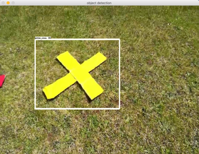
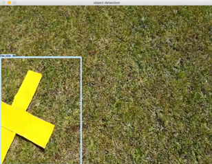
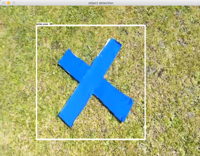
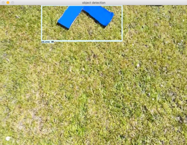
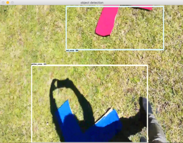
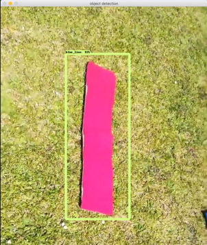
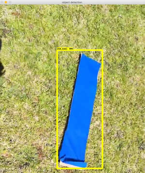

In automated flight, we do not want to miss targets, but most importantly, we do not want to deliver a package on something else than the corresponding target. That is, we want to minimize the number of **false positives**. In order to do so, we compute a **moving average on the $k$ last images**. If the moving average crosses a threshhold we fix at $0.8$, we can safely assume we rightfully detected a target.

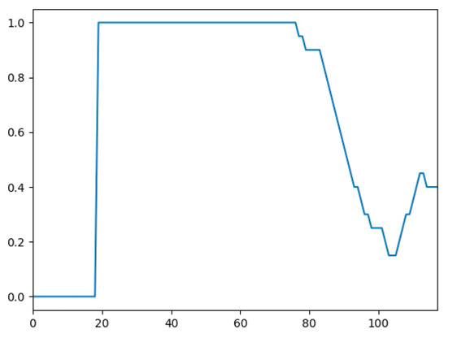

Figure: Plot of the moving average of detections we compute for each class during the flight

## Automating the Single Delivery Mission
Now that we have a satisfying model for detecting targets during the flight, we have to automate the process of exploring the area. The trajectory of the drone is determined by a takeoff and landind position (GPS coordinates).

The mission should elapse as follows:
1. Arm and Takeoff
2. Begin flying towards first waypoint
3. While True:
    - update the map
    - detect candidates from video stream
    - if candidate:
        - check that the moving average is above the threshhold
        - compute the position of the target (center of the bounding box converted to GPS coordinates relative to the current position of the drone)
        - go over the target
        - go down, deliver package and go back up
        - go to landing position

In order to dynamically display the explored map, we developped the *display_map.py* module using the *Tkinter* library, where we can monitor the altitude, position and detections of the drone.

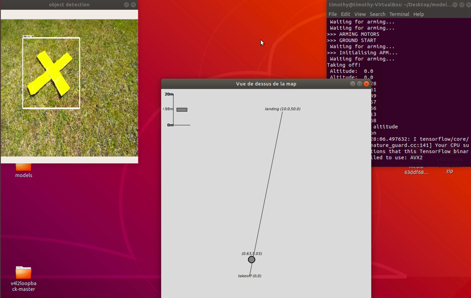

Left: processed video stream from the drone, Middle: display map window, Right: terminal

The drone goes over the target and detects it:

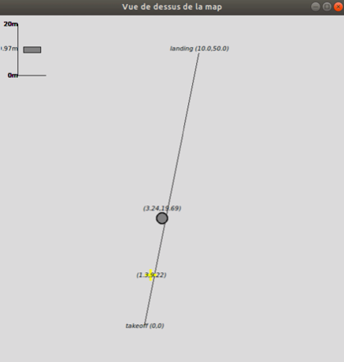

And delivers the right package on the detected target:

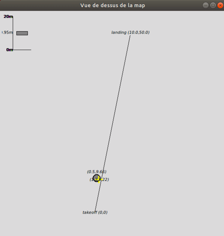

Before going back to the landing point.

### Mission accomplished!
